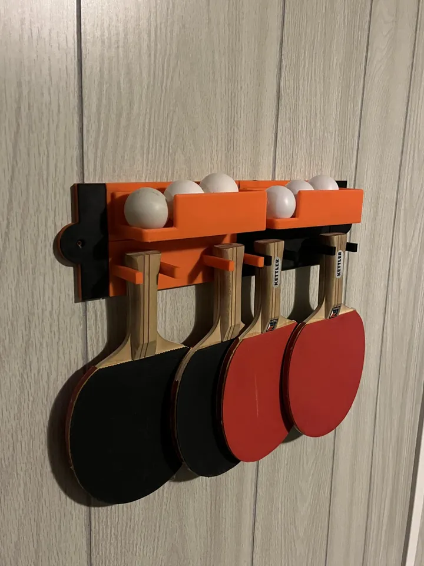
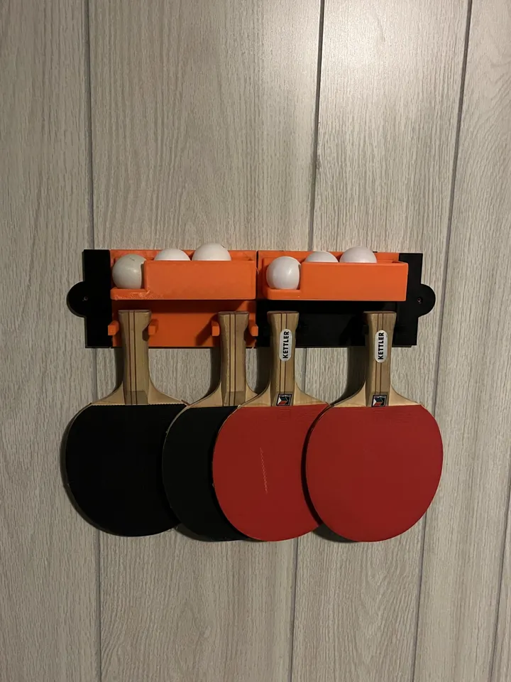
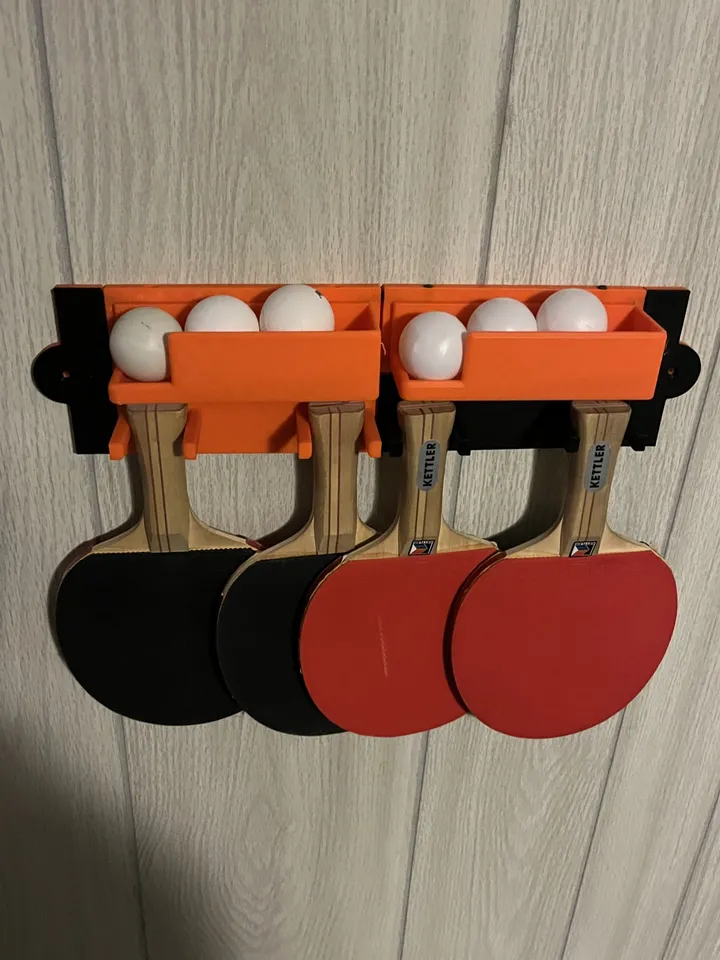

# Ping Pong Gear Holde
### Looking for a convient spot to store your ping pong gear. Welp here it is! With the Ping Pong Gear Holder you can store your ping pong gear on the wall, near your table, or wherever else you can double side tape it.

## Modules ##
| Module | Description | Link | Notes |
| ----------- | ----------- | ----| ----- |
| Ball Dispencer | Holds up to 3 ping pong balls for easy dispensing | https://github.com/HenryNerd/Ping-Pong-Gear-Holder/blob/main/Ball%20Dispencer%20v2.stl | Requires Supports |
| Paddle Holder | Holds 2 or 4 paddles deppending on your prefrences | https://github.com/HenryNerd/Ping-Pong-Gear-Holder/blob/main/Paddle%20Holder%20v2.stl |
| Wall Mount | Allows for unit to be wall mounted | https://github.com/HenryNerd/Ping-Pong-Gear-Holder/blob/main/Wall%20Mount%20v2.stl |
| Double Wall Mount | Same as the wall mount, except can connect to the sides of 2 modules | https://github.com/HenryNerd/Ping-Pong-Gear-Holder/blob/main/Double%20Wall%20Mount%20v1.stl | 
| Peg | The Peg used for connecting everything. You will need 2 per side your planing on connecting. | https://github.com/HenryNerd/Ping-Pong-Gear-Holder/blob/main/Peg%20v1.stl |

## Pictures ##

